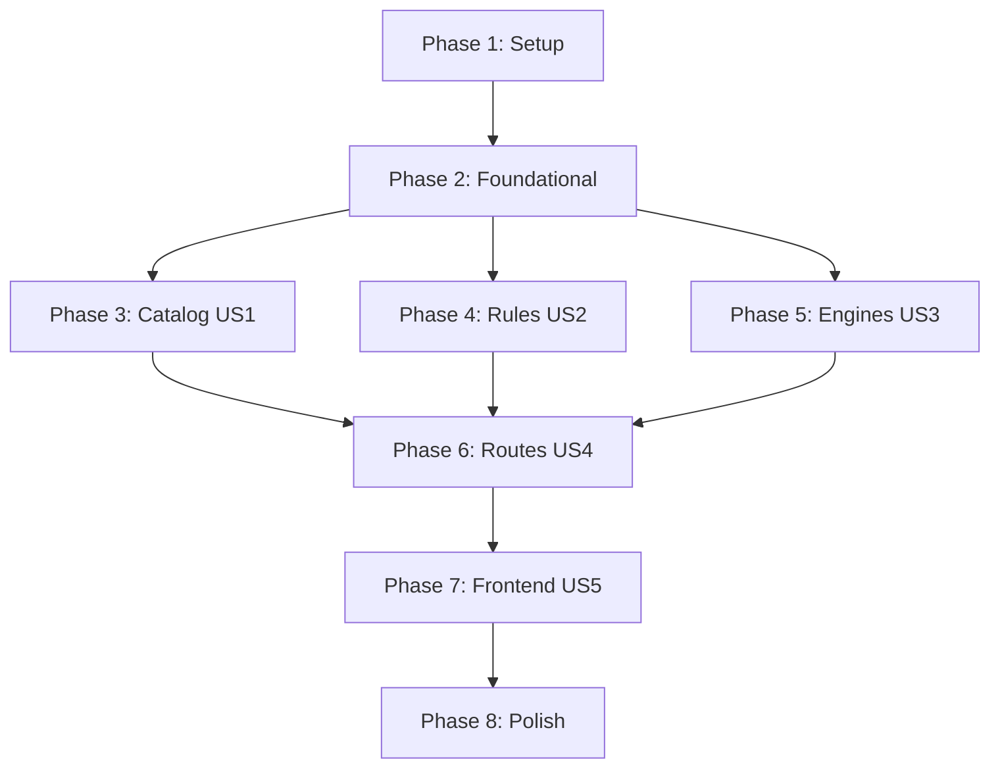

# Implementation Tasks: Token Cost Estimator and Optimizer

This document contains the step-by-step checklists to implement the Token Cost Estimator and Optimizer feature.

---

## Phase 1: Setup (Shared Infrastructure)

**Purpose**: Project structure initialization and configuration setup.

- [x] T001 Create project base folders `backend/src/` and `frontend/src/` per [plan.md](file:///c:/Users/gauth/OneDrive/Documents/Token/token-optimizer/specs/001-token-cost-estimator/plan.md)
- [x] T002 Initialize Python virtual environment and install FastAPI, motor, httpx, and pytest in `backend/requirements.txt`
- [x] T003 [P] Implement environment variable schema loading and secret validations in `backend/src/config.py`

---

## Phase 2: Foundational (Blocking Prerequisites)

**Purpose**: Core database connections, repository abstract classes, and index initialization blocking all other phases.

> [!IMPORTANT]
> No user stories can begin implementation until all foundational tasks in this phase are complete.

- [x] T004 Setup async MongoDB motor client startup/shutdown lifecycle events in `backend/src/database.py`
- [x] T005 Create database seed script with lifecycle phase reference data, catalog models, and default rules in `backend/scripts/seed.py`
- [x] T006 [P] Implement index definition script verifying unique index constraints in `backend/scripts/create_indexes.py`
- [x] T007 Implement shared application secret validation middleware in `backend/src/middleware.py`
- [x] T008 Implement admin Bearer Token authorization dependency handler in `backend/src/admin_api/auth.py`
- [x] T009 Create centralized error logging and HTTP exception handlers in `backend/src/main.py`

**Checkpoint**: Foundation ready - user story implementation can now begin.

---

## Phase 3: User Story 1 - Model & Provider Catalog (Priority: P1)

**Goal**: Establish authoritative pricing repository, normal user read endpoints, and admin-managed pricing/catalog updates with version audit tracking.

**Independent Test**: Admin CRUD updates are verified to correctly increment pricing versions and write history records, while GET /models returns only active models.

### Implementation for User Story 1

- [x] T010 [P] [US1] Define model and provider pricing Pydantic schemas in `backend/src/schemas.py`
- [x] T011 [P] [US1] Create models catalog database interfaces in `backend/src/repository.py`
- [x] T012 [US1] Implement normal user endpoint `GET /models` returning only active models in `backend/src/main.py`
- [x] T013 [US1] Implement admin models catalog CRUD endpoints (`GET /admin/models`, `POST /admin/models`, `PATCH /admin/models/{model_id}`) in `backend/src/admin_api/routes.py`
- [x] T014 [US1] Implement admin model status actions (`POST /admin/models/{model_id}/activate`, `POST /admin/models/{model_id}/deactivate`) in `backend/src/admin_api/routes.py`
- [x] T015 [US1] Implement admin provider endpoints (`GET /admin/providers`, `POST /admin/providers`, `PATCH /admin/providers/{provider_id}`) in `backend/src/admin_api/routes.py`
- [x] T016 [US1] Implement model pricing update handler to log changes to the `pricing_history` collection in `backend/src/admin_api/routes.py`
- [x] T017 [US1] Implement audit query endpoint `GET /admin/models/{model_id}/pricing-history` in `backend/src/admin_api/routes.py`
- [x] T018 [US1] Write integration tests verifying database pricing version increment and audit logging in `backend/tests/integration/test_catalog.py`

**Checkpoint**: User Story 1 catalog management is fully functional.

---

## Phase 4: User Story 2 - Optimizer Rules Administration (Priority: P2)

**Goal**: Allow administrators to configure rule thresholds and expected cost-reduction parameters dynamically.

**Independent Test**: Verify admin rules endpoints support creation, updates, and deactivation of versioned optimizer rules.

### Implementation for User Story 2

- [x] T019 [P] [US2] Define optimizer rules schemas and comparison conditions in `backend/src/schemas.py`
- [x] T020 [P] [US2] Implement optimizer rules repository queries in `backend/src/repository.py`
- [x] T021 [US2] Implement admin rules CRUD endpoints (`GET /admin/optimizer-rules`, `POST /admin/optimizer-rules`, `PATCH /admin/optimizer-rules/{rule_id}`) in `backend/src/admin_api/routes.py`
- [x] T022 [US2] Implement admin rule action routes (`POST /admin/optimizer-rules/{rule_id}/activate`, `POST /admin/optimizer-rules/{rule_id}/deactivate`) in `backend/src/admin_api/routes.py`
- [x] T023 [US2] Add unit tests for rule validation schemas and logic in `backend/tests/integration/test_rules_admin.py`

**Checkpoint**: User Story 2 rules configuration is fully functional.

---

## Phase 5: User Story 3 - Calculation Cost & Optimization Engines (Priority: P3)

**Goal**: Implement the core math formulas and compound rule evaluations in side-effect-free pure functions.

**Independent Test**: Pytest fixtures verify math equations for effective tokens, caching fractions, raw costs, batch API discounts, and multi-year AMS projections.

### Implementation for User Story 3

- [x] T024 [P] [US3] Create pure functions for input split, phase cost, batch pricing, and AMS projections in `backend/src/calc_engine.py`
- [x] T025 [P] [US3] Create pure rule matching and capped compounding rule evaluation logic in `backend/src/rules_engine.py`
- [x] T026 [US3] Implement unit tests verifying exact formula outcomes and the compounding stacked ceiling limits in `backend/tests/unit/test_calc_engine.py`

**Checkpoint**: Core calculation logic is complete and fully covered by unit tests.

---

## Phase 6: User Story 4 - Calculation Endpoints & Adapters (Priority: P4)

**Goal**: Bind API endpoints `/extract`, `/estimate`, `/optimize`, and `/discover-optimizations` to calculation and LLM services.

**Independent Test**: endpoints run calculations using MongoDB catalog snapshots, relay user keys, and validate savings constraints.

### Implementation for User Story 4

- [x] T027 [P] [US4] Create async HTTP adapters for OpenAI, Google, and Anthropic in `backend/src/llm_adapters.py`
- [x] T028 [US4] Implement route `POST /extract` calling LLM to output structured lifecycle JSON phase configurations in `backend/src/main.py`
- [x] T029 [US4] Implement route `POST /estimate` fetching active model pricing snapshots and executing calc engine in `backend/src/main.py`
- [x] T030 [US4] Implement route `POST /optimize` evaluating deterministic rules against estimate config in `backend/src/main.py`
- [x] T031 [US4] Implement route `POST /discover-optimizations` invoking LLM to suggest custom cost actions with isolated savings in `backend/src/main.py`
- [x] T032 [US4] Write integration tests verifying endpoint JSON contracts, error handling, and key relaying in `backend/tests/integration/test_endpoints.py`

**Checkpoint**: Core API layer is fully complete.

---

## Phase 7: User Story 5 - Frontend Client SPA (Priority: P5)

**Goal**: Deliver the browser SPA with local state persistence, user API key rotation, Dashboard tabs, and Management catalog tables.

**Independent Test**: Frontend displays phase inputs, requests extraction, allows edits, runs calculations, displays compound graphs, and rotates user keys.

### Implementation for User Story 5

- [x] T033 [P] [US5] Implement client-side key storage and sequential rotating key pool logic in `frontend/src/services/api_keys.js`
- [x] T034 [US5] Implement Dashboard home tab with project input, local summary file processor, and interactive phase table in `frontend/src/components/Dashboard.js`
- [x] T035 [US5] Implement Dashboard optimization panel separating deterministic cost savings from advisory/AI potential in `frontend/src/components/OptimizerPanel.js`
- [x] T036 [US5] Implement Management tab displaying rotating key statuses and admin models/rules tables in `frontend/src/components/Management.js`
- [x] T037 [US5] Embed application bootstrap, routing, and global stylesheets in `frontend/index.html` and `frontend/styles.css`

**Checkpoint**: Front-to-back integration complete.

---

## Phase 8: Polish & Cross-Cutting Concerns

**Purpose**: Security, load verification, error logging audits, and documentation refinement.

- [x] T038 [P] Write security auditing tests verifying credentials and relayed API keys are excluded from server logs in `backend/tests/security/test_security_audit.py`
- [x] T039 Implement concurrency tests verifying the backend manages >=10 simultaneous calculation requests in `backend/tests/performance/test_load.py`
- [x] T040 [P] Complete developer documentation and verify end-to-end flow using [quickstart.md](file:///c:/Users/gauth/OneDrive/Documents/Token/token-optimizer/specs/001-token-cost-estimator/quickstart.md)

---

## Dependencies & Execution Order

### Phase Dependencies

### Parallel Opportunities

- **Setup & Foundational**:
  - `T003` (Config) can run in parallel with project directory structure setup.
  - `T006` (Indexes) and `T008` (Auth) can be worked on in parallel once database connection logic (`T004`) is established.
- **User Stories (Phase 3 & 4)**:
  - Phase 3 (Catalog) and Phase 4 (Rules) models/repository files can be written in parallel.
- **Calculation Engines**:
  - `T024` (Calc engine) and `T025` (Rules engine) are isolated Python modules and can be implemented in parallel.

---

## Implementation Strategy

### MVP First (Core Estimation Engine)
1. Complete Setup and Foundational directories (Phases 1 and 2).
2. Seed basic lifecycle phases and models.
3. Build the pure calculation engine (`T024` and `T026`).
4. Implement `POST /estimate` endpoint (`T029`) mapping inputs directly.
5. Validate via unit tests. At this stage, token estimation can be fully validated.

### Incremental Delivery Flow
1. **Catalog CRUD**: Build Admin Catalog and history audit (Phase 3).
2. **Rules CRUD**: Add admin optimizer rules configuration (Phase 4).
3. **Rules Optimization**: Implement `POST /optimize` compounding rules (Phase 5 & 6).
4. **AI Discovery**: Implement `POST /discover-optimizations` advisor.
5. **Frontend GUI**: Tie components together in HTML/JS layout (Phase 7).
